Direct Authoring Example: SillyMorph
====================================
*by Ken Dickey*

This file details morphic authoring with almost no code.

The created Morph does nothing serious, but
introduces some ways of using UI-Tools.

So of course, we start by requiring UI-Tools.

````Smalltalk
  Feature require: 'UI-Tools'.
````
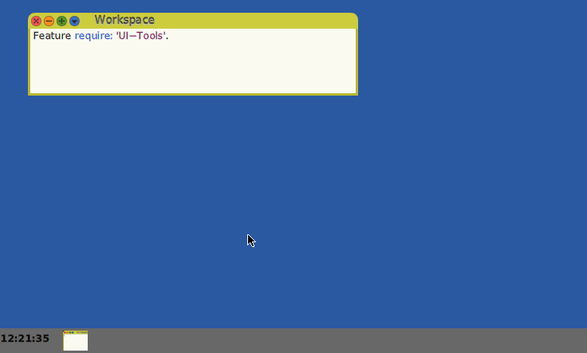

We start with a Panel.

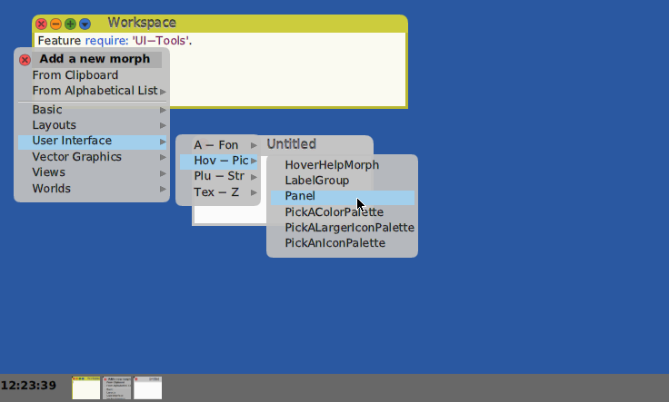

### Editing Morph Visual Properties

'Untitled' is an uninteresting label.  Let's change it.

Middle clicking on the Panel exposes its construction handles.

We want to click on the title area to change it.

Multiple clicks have meaning.  Each additional click invokes construction handles on a contained submorph.

So, 1st click selects the Panel Morph, Clicking the second time selects the WindowTitleMorph, and the third time selects the SqueezeLabelMorph, which is the one we want.

Selecting the blue halo button yields the SqueezeLabelMorph's menu.

You can click on the menu's push pin in the upper right to keep
it around for multiple uses, but in this case we only want to
change the title, so select the #contents: menu item to bring
up a simple editor.

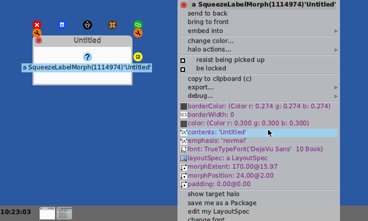

Notice that the #'UI-Tools' package requires the MetaProperties package, which adds the purple menu selections.

These are _Visual Properties_ which may be clicked on to get and editor
or selection pallet(s) or dragged from this menu onto another menu
with the same kind of selection to copy values between Morphs.

In this case, clicking on #contents: brings up a simple
string editor which allows us to change the title.

I think this is a Silly Example.  ;^)

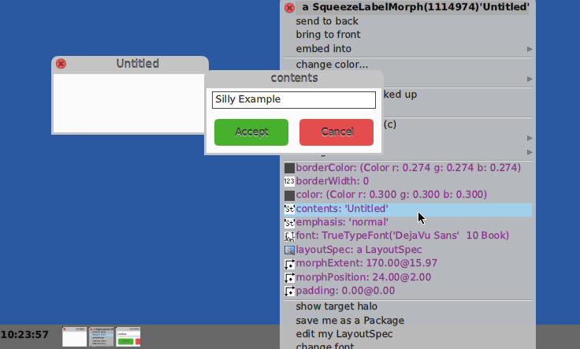

By the way, the reason for the name #SqueezeLabelMorph is that you
can reduce the size of the panel and the text will try to remain
sensible even with fewer letters.

You can click select the Panel and use the yellow Change Size handle
on the lower right to make the Panel larger or smaller to see how this
works.

OK. Lets play a bit.

### Morph Embedding

I used the World Menu to get a New Morph.  In this case
a BorderedBoxMorph.

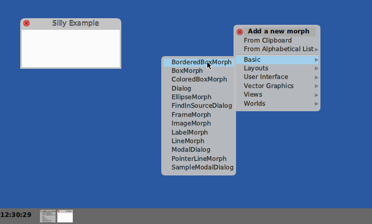

You have probably noticed that inheritance is used to separate
out features so it is easier to see what methods implement which
feature.

If you bring up a Browser (not shown) you will see that:

A PlacedMorph adds to Morph #location and #layoutSpec.

BoxMorph adds #extent to PlacedMorph's location.

ColoredBoxMorph adds color selection to a BoxMorph.

And, as you might suspect, a BorderedBoxMorph adds #borderWidth
 #borderColor and #padding to ColoredBoxMorph.

All of the added methods could of course be in one globbed level, but
we want it easy as possible to find support of
separate aspects or features.

Hey, I like easy! ;^)

We can bring up the new BorderedBoxMorph's menu.

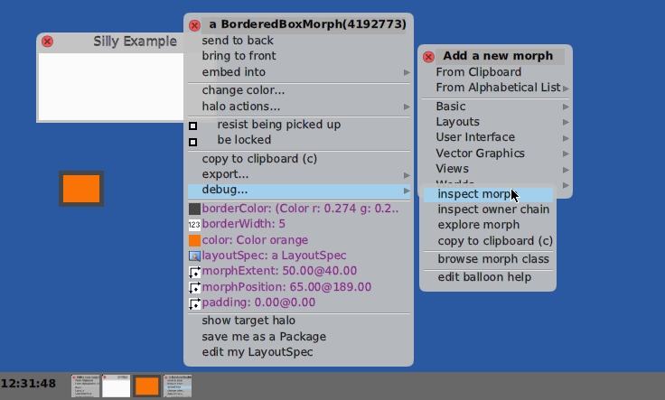

In this case I want to add the BorderedBoxMorph into the Panel, which
I can do by dragging it over the Panel to where I want it
and using its menu to embed it.

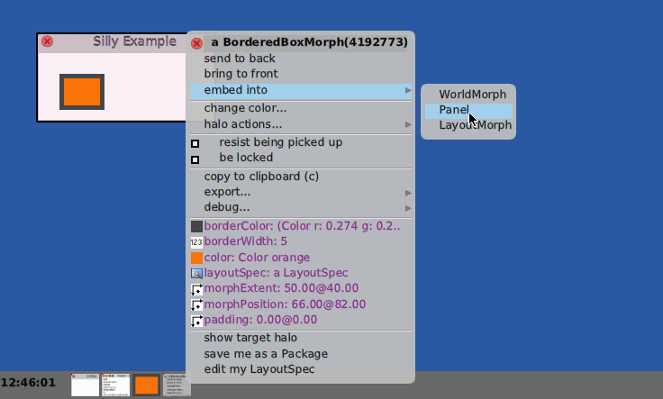

### Make the BorderedBoxMorph properties do something

One can add a method to a Class to get something to happen
for all Morphs of that class, but it is often useful to
have a special behavior for an individual Morph.

Morph can have Properties, which map Symbols to values.

Some of these are used to obtain instance specific behaviors.

For example, if you look at the Morph method for #mouseEnter:
you will see:
````Smalltalk
	self 
		valueOfProperty: #mouseEnter: 
		ifPresentDo: [ :handler | handler value: evt ]
````
We use those here to get our BorderedBoxMorph to change color when
the cursor (a HandMorph) is over the Morph.

We can write code and evaluate it in an inspector:

BorderedBoxMorph -> Menu -> Debug -> inspect

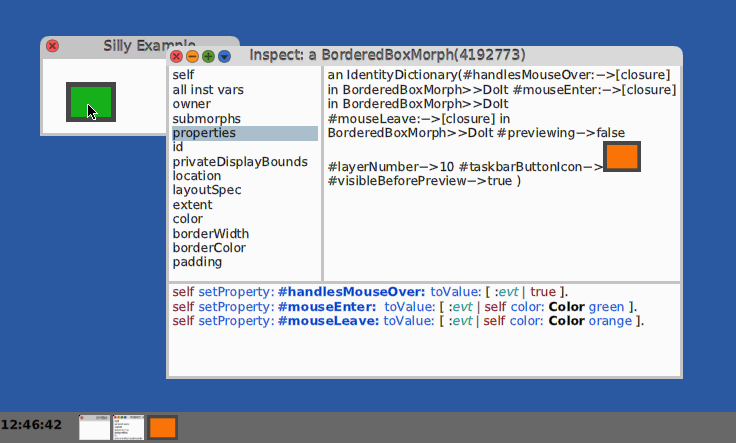

### Make a Label into a Button.

Let's make a LabelMorph react to a mouse click.

First, get a LabelMorph from the WorldMorph -> New Morph.. menu.

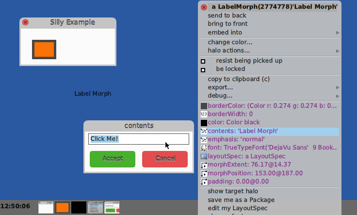

Now use the LabelMorph's menu to change the Label's text to 'Click Me!'.

Please embed the Label into the Panel.

Make the LabelMorph's color: `Color red`.

Now Color computing is complex, so you get the choice of a Color Editor
or one of a selection of _named color_ dictionary palettes, from which
you can drag a color _swatch_ onto the menu's #color: menu item.

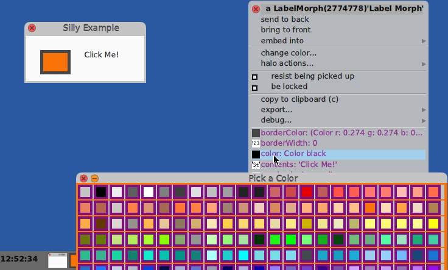

Making the #emphasis: be #bold is also helpful.

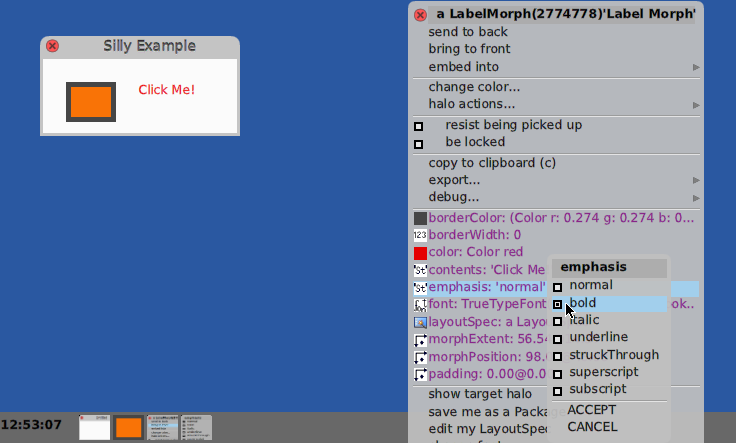

Now we can make the Label behave like a button.

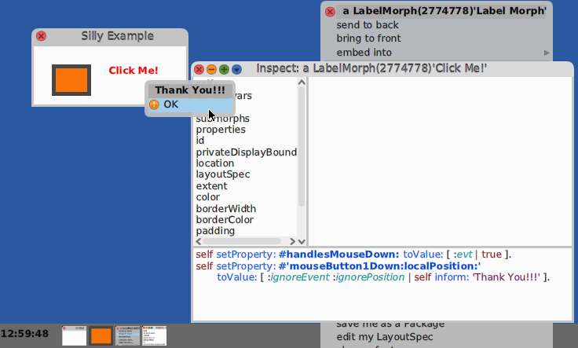

### MetaProgramming -- Save as a Package

Most times you won't want to do this, but in this case, I
re-selected the Panel, selected it's menu 'save me as a Package',
and gave it a name, 'SillyMorph'.

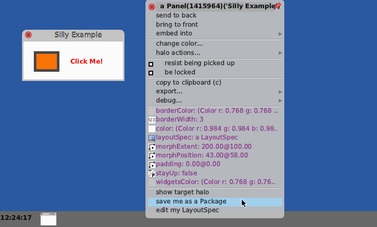

Now, two files were created:
- SillyMorph.pck.st   -- the Package file
- SillyMorph.obj      -- the filed-out Panel object

We can now quit the image.

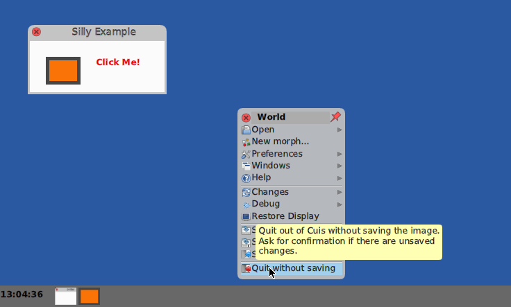

Start a fresh image and open a Workspace.

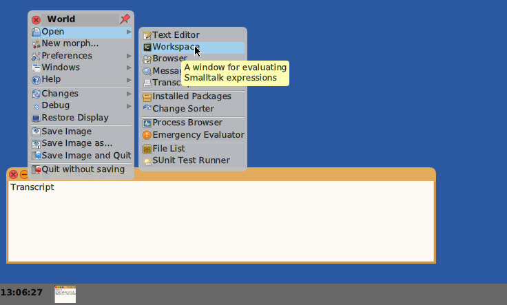

And #require: the #'SillyMorph' package which we just created.

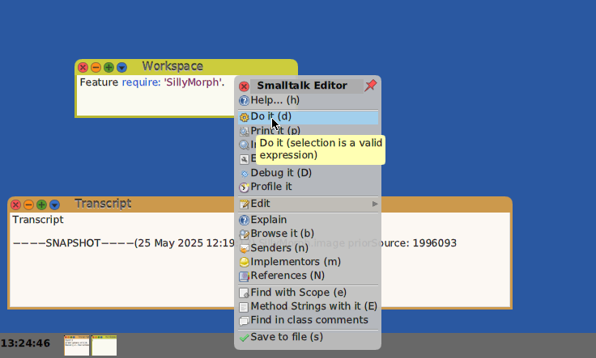

The required SillyMorph Package re-constitutes the Panel and it code.

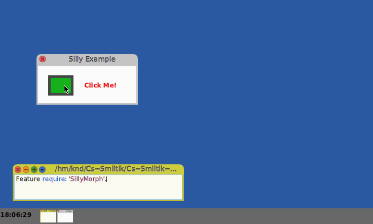

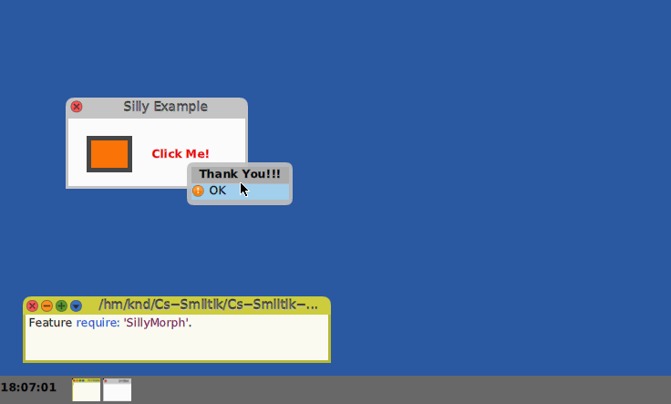

### Why 2 Files?

Saving a live Smalltalk Morph object into an .obj file
allows it to be re-created
later in another image, but we need to ensure that the _backing code_
required to run the code is present.

You can (and should) look at the Morph>>SaveAsPackage: code
if interested, but basically it creates a Package which, as you
saw, loads any required Packages and then the saved composit
Morph.

You can view the
SillyMorph.pck.st (probably in the Cuis-Smalltalk-Dev-UserFiles
directory) to see the mechanics.  This is pretty simple.

### Minimal Packages

One thing you may have noticed is that only the minimum of
Packages are required.

You can see this by opening the Package Manager

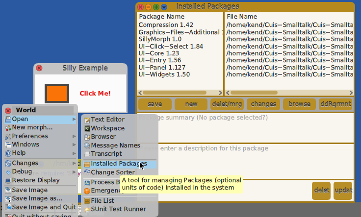

Note the loaded Packages.

Now require 'UI-Tools' and see what else shows up.

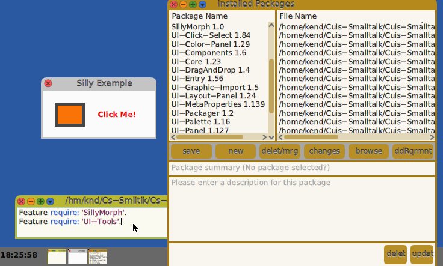

Hey, much going on with this silly example, but this intro is getting
much too long, so I will stop here.

I hope you are learning, importantly, how to have fun with this!!

Enjoy!
