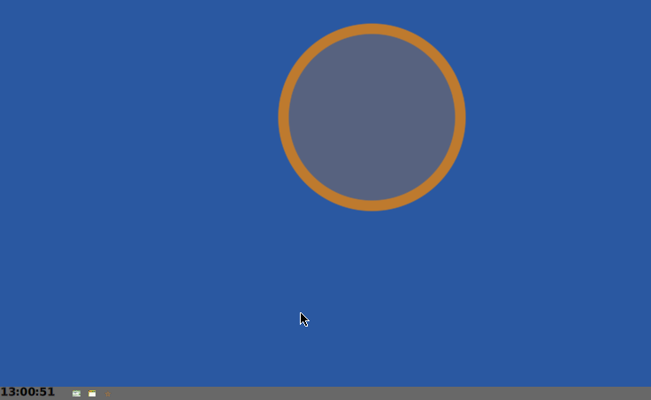

Morph Animation Example: AnimatedStar
=====================================
*by Ken Dickey*

This is Part 2 of a tutorial using _stepping_ to animate a Morph.

Please read Part 1 first.

- [Read part 1](README.md)

### New Morph from Menu

By default, Morphs can be obtained via the World Menu >> new morph... submenus.

We can get a new AnimatedStar Morph this way too.


If we don't want to be included in the new morph submenus, we can
implement a Class method.
````Smalltalk
MorphClass>>includeInNewMorphMenu
	"Return true for all classes that can be instantiated from the menu"
	^ false
````
In this case, we _do_ want to be able to be created with a new morph submenu.

Note that one can supply an #initializedInstance (browse implementors) but
we don't need to do that, so we won't.

OK. We get a new morph, but we need to start stepping.


One way to do this is with its morph menu >> debug... >> inspect morph .


We can then ask itself to start stepping.


OK. That works, but we can make this a bit easier by adding
selections to the Morph's menu.


Now we can start stepping from the morph's menu without opening an inspector.


Looks good, but trying to select a moving Morph to get its menu is
a problem.

One way to do this is with a Workspace.

Each class knows all of its instances, so we can ask the class to stop stepping
its Morph instances.


Well, that works.  But perhaps we can "define away" the problem.

First, we save our image -- always good to do at a stable point
before adding something new.

So, what to do?

One approach is to limit the AnimatedStar Morph's lifetime.

Let's limit the number of times it bounces off a wall.

Also, it is good feedback to make some change the user (us!) will
notice when the termination occurs.  Let's do that too.

### Self terminating AnimatedStars

My approach is to keep a #bounceCount and a #isTerminating boolean (more
on this below).


We need to set these in #initialize.


I want to draw differently when the Morph is normal and when it is terminating.

Let's rename the typical case.


For the terminating case, I will change from a Star to a Circle.


We can change #drawOn: to do what we want.


A new #step method can check the #bounceCount and
either #animateAStep or #terminate.


I added a #maxBounce accessor to return 10 (bounces -- not shown,
but you know what to do here).

### Asynchronous Timers

The #terminate method is somewhat interesting.

In this case we stop stepping, redraw ourselves to get a circle,
and set an asynchronous timer to go off later to delete our instance.


The #fork message sent to a Block invokes the Block on a new Thread.

It is quite important to use a different thread because otherwise
we would be blocking the thread which is stepping the user interface.

We don't want to stop the world, just have our instance deleted at
a later time.

You can play with different timeout values to see what looks good to you.

We can keep the books up to date by incrementing #bounceCount in #animateAStep.


#startStepping now needs to invoke our new #step method.


OK.  Time to try things out.

Save out image, get a "new morph.. >> Vector Graphics >> AnimatedStar",
startStepping, watch it move about and..



Celebrate success!!

### Make it more lively

Now for some fun.  We have a lot working.

The only thing more fun than an AnimatedStar is a bunch of AnimatedStars!

When we hit a wall, we can clone a copy of ourself and send it off
in another direction.

Since we just hit a wall, we can send the copy in the direction we came from

This is easy to do in #animateAStep.


Now #animateAStep is a large method. Here is the complete code


````Smalltalk
animateAStep
    "Continue to move in direction or bounce off edge of containing owner"
    | ownerExtent hitWall otherDelta | 
    hitWall := false.
    self morphPosition: self morphPosition + myDelta.
    ownerExtent := self owner morphExtent.
    (self morphPosition x <= self radius) "Hit left wall"
        ifTrue: [ 
            hitWall := true.
            self morphPosition: self radius @ (self morphPosition y). 
            myDelta := myDelta x negated @ myDelta y.
            otherDelta := myDelta x @ myDelta y negated.
    ].
    (self morphPosition y <= self radius) "Hit top wall"
        ifTrue: [ 
            hitWall := true.
            self morphPosition: (self morphPosition x) @ self radius. 
            myDelta := myDelta x  @  myDelta y negated.
            otherDelta := myDelta x negated @ myDelta y.
    ].
    ((self morphPosition x + self radius) >= ownerExtent x) "Hit right wall"
        ifTrue: [ 
            hitWall := true.
            self morphPosition: (ownerExtent x - self morphExtent x) 
                                    @ (self morphPosition y). 
            myDelta := myDelta x negated @ myDelta y.
            otherDelta := myDelta x @ myDelta y negated.
    ].
    ((self morphPosition y + self radius) >= ownerExtent y) "Hit bottom wall"
        ifTrue: [ 
            hitWall := true.
            self morphPosition: (self morphPosition x) 
                                    @ (ownerExtent y - self  morphExtent y). 
            myDelta := myDelta x  @ myDelta y negated.
            otherDelta := myDelta x negated @ myDelta y.
    ].

    hitWall ifTrue: [ 
        color := Color random.
        bounceCount := 1 + bounceCount . "How many times I hit a wall"
        "clone self with different direction"    
        (self numLiveInstances < 12)    "Don't spawn exponentially"
        ifTrue: [ | myClone |
            myClone := self copy.
            myClone myDelta: otherDelta;
                    color: Color random;
                    openInWorld; 
                    startStepping.
        ]
    ].
````

To set values in our copy, we need to add a couple of accessors
to update #myDelta: and #color:


We also need to know the number of _live_ instances.

Until the garbage is collected, dead instances can hang around, but
we don't want to deal with them.

We do the simple thing here.


Save our image again, and let's try things out.


Wow!  I like this!  I hope you do too!

### Make a Package

We started by making a Class Category named 'Morphic-AnimatedStar'.

Let's use this to make a Package so we can easily share our code.

We open Installed Packages from the World Menu.


Click on the _New_ button, fill in 'Morphic-AnimatedStar' to create a
Package with the name we gave our Class Category and fill in a
description of our Package.


We don't have dependencies on anything other than the base package, but it
is a good idea to require at least the current version of Cuis-Base.


Clicking the _Save_ button actually saves our Package into a file.


### Test Package in a New Image

Let's be sure to save and close our current image, start with a fresh
image, and #require: our package.


We should now be able to see our AnimatedStar selection in the "new morph.."
submenu.


So we can get a new AnimatedStar, startStepping, and ...


Celebrate and share success!!


