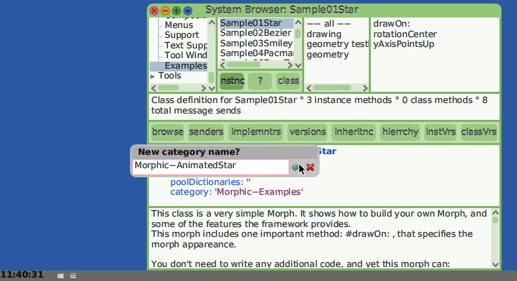

Morph Animation Example: AnimatedStar
=====================================
*by Ken Dickey*

This tutorial shows how to use timer events to animate a Morph.

We start by subclassing Morphic-Examples: Sample01Star Class.


### Add a new Class Category

We will want to save our code as a Package, so the first thing to
do is right-click on the upper-left pane of a Browser and add
a new Class Category which we will name 'Morph-AnimatedStar'.

### Make a new Subclass



We want to add color changes and movement in a direction, and will
use instance variables #color and #myDelta for this. #myDelta
will be a point difference (delta) between one step and the next.


We will be adding methods in several Method Categories,
starting with 'initialization'.


The #initialize method does setup for an instance.

In general, the first thing we want to do is invoke
````Smalltalk
    super initialize.
````
we can then add local actions.


Rather than scattering numbers throughout the code, it is
a good idea to add accesors which we can easily change,
so any change only happens in one plase.


We want to have our own drawing method to be able to
make changes locally, but use our own values.

This looks a lot like the drawing method of our parent.


### Stepping

Computers in general have a clock which announces events (interrupts)
at time intervals.

Smalltalk moves virtual time forward in _steps_ which happen at
specified intervals, starting at a specific clock time.

To get a Morph to _move_, we need to change its location
each time it steps forward.

We set this up in a method #startStepping.


For our uses, it is convenient to set up our
step time in _milliseconds_.


Each time our AnimatedStar Morph steps, as specified
in our #startStepping method, a message #animateAStep
is sent to our Morph instance.

So now we need to decide what we want to see when this happens.

Here is some code which makes our Morph move, but change direction
when it hits the edge of our owner, our containing Morph.  For us
this is typically the World Morph.

Moving is easy:
````Smalltalk
   self morphPosition := self morphPosition + myDelta.
````
We then have to check to see if we have "hit a wall" and change
direction by changing the sign of the point: myDelta #x or #y,
depending on which border we have reached.


Now, before we push the airplane off the cliff to see if it flies,
is a good time to pause and save our image.


One way forward is to just try it out and see if it flies.


In this case -- not good.

One problem with timer interrupts is that they just keep coming.

Here our image gets a new debug window at each step and this happens
too frequently for us to stop it -- we must kill the image.


Good thing we saved our imag first!  8^)

OK. We can eat the problem in smaller bites.

We can step ourselves without being driven by a timer.


What happens is that a star moves across the display until it hits
an edge and then we get _one_ instance of a debug window, which
is much easier to deal with.


The debug window lets me know a Point was expected, but I don't
know where.  So I open an inspector on my AnimatedStar and look
at values which #animateAStep expects to be Points.


Aha! When I wrote the code to bounce off the walls, I expected
the Morph being animated to know its extent (width and height),
but a #Sample01Star inherits from #PlacedMorph, which has a _location_
but not an _extent_.

How to address this?

If I middle-click on my AnimatedStar Morph, I see that the unscaled
Morph is centered at 0@0 and is sized approximately from -100 to 100
on each axis.  It would approximately fit in a circle of radius 100.


Let's create an accessor for #radius.


Now we can use #radius where we were looking to use extent.


OK.  Try it now -- and we bounce off the walls!

Celebrate success!!  8^)


Oops, something is not quite right.  We are going a bit beyond some
walls.

Looks like the center of the star is bouncing off walls.

Well, we can fix this!  We have a #radius.


Ah!  Much better.

Celebrate more success!  ;^)

Oh, wait.  We were supposed to be doing this in color.

Ah.  Dumb me.  I wrote a method #draw: but the parent method
to be overwritten is named #drawOn:.

Good thing we have refactoring tools!


Try again, and..


Great!  Celebrate success!!

Let's save out image and go on to Part2 !

- [Read part 2](AnimatedStarPart2.md)


